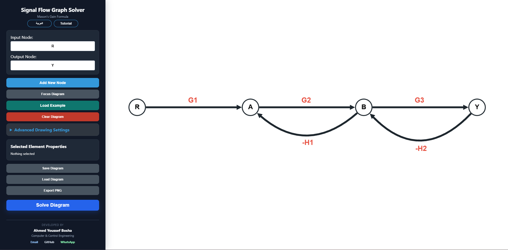
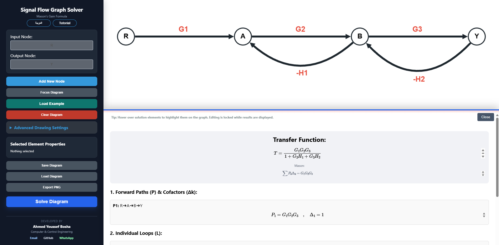

<div align="center">

# Signal Flow Graph Solver

**Interactive engineering tool for building and solving Signal Flow Graphs using Mason's Gain Formula**

[Live Demo](https://sfg-solver.onrender.com/) · [GitHub Profile](https://github.com/R3Dzf) · [Email](mailto:ahmedyoussefmansourbosha@gmail.com)

</div>

---

## Overview

Signal Flow Graph Solver is a web-based engineering application that lets users **draw, validate, and solve signal-flow graphs interactively**.

The solver detects forward paths, feedback loops, and non-touching loop combinations, then applies **Mason's Gain Formula** to produce the symbolic transfer function together with the intermediate calculation steps.

### Interactive Graph Editor



### Mason's Gain Formula Analysis



> **Try it online:** [sfg-solver.onrender.com](https://sfg-solver.onrender.com/)

---

## Key Features

- Interactive node and directed-branch editor.
- Symbolic branch gains such as `G1`, `H1`, `G1*G2`, and rational expressions.
- Automatic detection of **forward paths**.
- Automatic detection of **individual feedback loops**.
- Detection of **non-touching loop combinations**.
- Calculation of Mason's determinant **Δ** and path cofactors **Δk**.
- Symbolic final **transfer function**.
- Independent verification using a linear-equation formulation.
- Validation for duplicate node names, invalid gains, missing nodes, and input/output connectivity.
- Support for parallel branches.
- Built-in example graph for instant testing.
- Save and load diagrams as JSON.
- Export diagrams as PNG.
- English and Arabic interface.
- Interactive guided tutorial.
- Responsive interface for different screen sizes.

---

## How to Use

1. Set the **Input Node** and **Output Node**.
2. Add the required intermediate nodes.
3. Connect nodes with directed branches.
4. Select a branch and enter its symbolic gain.
5. Press **Solve Diagram**.
6. Review the transfer function, forward paths, loops, non-touching loops, Δ, and Δk.

For a quick demonstration, press **Load Example** and then **Solve Diagram**.

---

## How the Solver Works

The application follows the same engineering workflow used when solving a Signal Flow Graph manually:

1. The graph is validated before calculation.
2. **NetworkX** identifies forward paths and simple cycles.
3. Branch gains are converted into symbolic expressions.
4. Loop gains and non-touching loop combinations are calculated.
5. Mason's determinant is constructed:

```text
Δ = 1 - Σ(individual loop gains)
    + Σ(products of two non-touching loops)
    - Σ(products of three non-touching loops)
    + ...
```

6. Each forward-path cofactor `Δk` is calculated.
7. Mason's Gain Formula is evaluated:

```text
T = Σ(Pk × Δk) / Δ
```

8. The result is independently cross-checked using a linear-system formulation.

---

## Tech Stack

| Layer | Technologies |
| --- | --- |
| Backend | Python, FastAPI, NetworkX, SymPy, Pydantic |
| Frontend | HTML, CSS, JavaScript, jQuery |
| Graph UI | Cytoscape.js |
| Drawing / interaction | Konva.js |
| Symbolic math display | MathJax |
| Deployment | Render |

---

## API

### `POST /validate`

Validates:

- node names
- branch gains
- graph structure
- input/output nodes
- connectivity

### `POST /solve`

Returns:

- transfer function
- forward paths
- path gains
- individual loops
- non-touching loop combinations
- `Δ`
- `Δk`
- symbolic intermediate results

---

## Run Locally

Clone the repository and install the dependencies:

```bash
git clone https://github.com/R3Dzf/Signal-Flow-Graph-Solver.git
cd Signal-Flow-Graph-Solver
pip install -r requirements.txt
```

Start the application:

```bash
uvicorn app:app --reload
```

Then open:

```text
http://127.0.0.1:8000
```

---

## Project Structure

```text
Signal-Flow-Graph-Solver/
├── app.py
├── requirements.txt
├── frontend/
│   ├── index.html
│   ├── i18n.js
│   ├── tutorial.js
│   └── JavaScript libraries
├── docs/
│   ├── graph-editor.png
│   └── solver-results.png
└── README.md
```

---

## Engineering Value

This project combines **Control Systems**, **Graph Theory**, **Symbolic Mathematics**, and **Web Development** in one practical application.

Instead of returning only a final transfer function, the solver exposes the intermediate engineering analysis so that the result can be inspected and understood step by step.

---

## Author

**Ahmed Youssef Bosha**  
Computer & Control Engineering — Tanta University

- **Email:** [ahmedyoussefmansourbosha@gmail.com](mailto:ahmedyoussefmansourbosha@gmail.com)
- **GitHub:** [github.com/R3Dzf](https://github.com/R3Dzf)
- **WhatsApp:** [Contact on WhatsApp](https://wa.me/201010449138)

